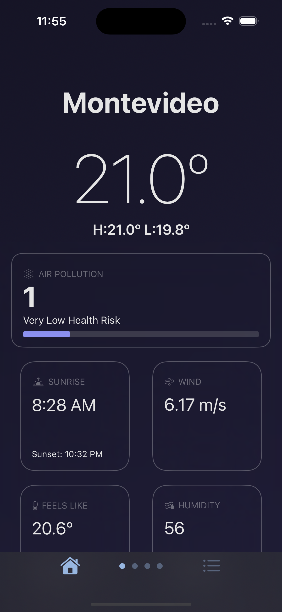
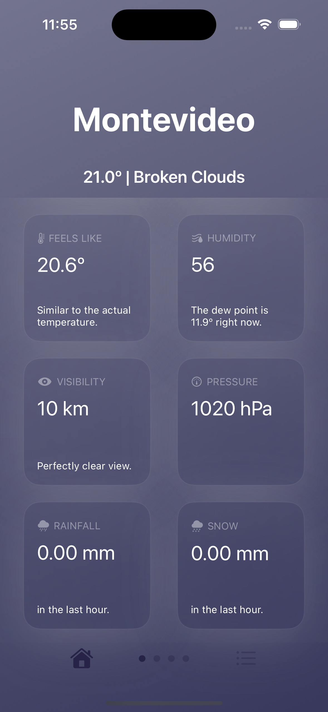
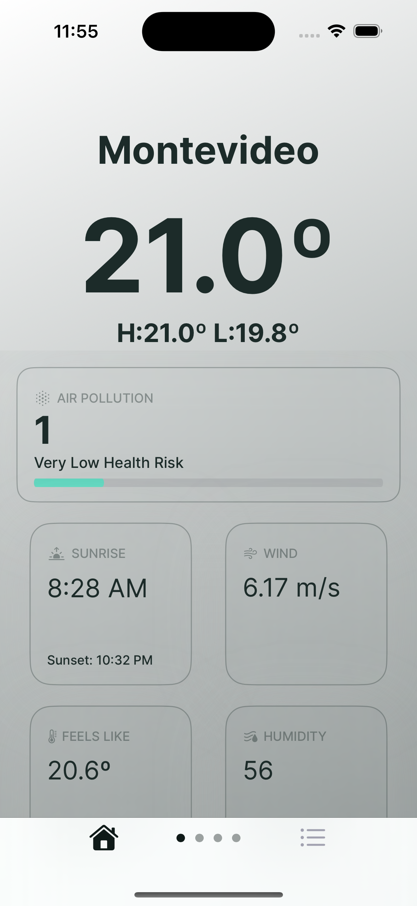
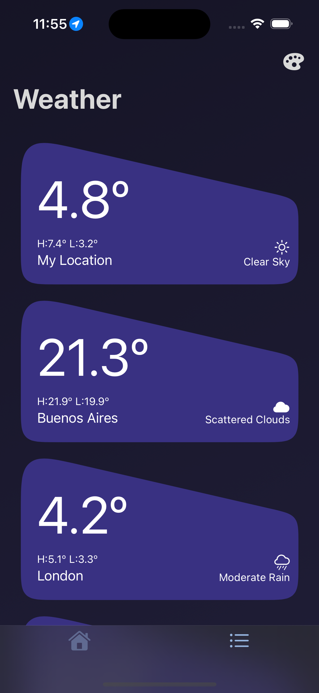
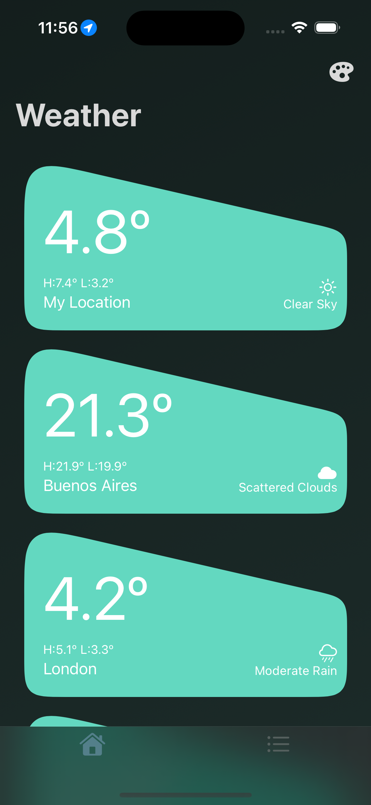
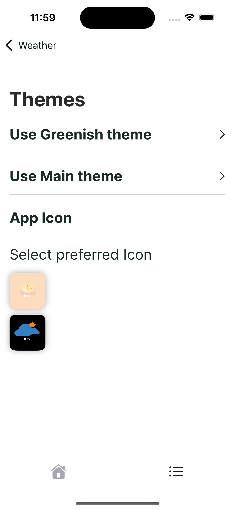

# Weather App 🌦️  

A sleek, modern SwiftUI weather app providing comprehensive weather information. Easily browse weather data for multiple locations, customize themes, and enjoy a smooth user experience—all while adhering to best development practices.  

---

## 🚀 About the App  

Weather App is a SwiftUI-based application designed with the following features:  
- **Weather Details**: Get current weather information at a glance.  
- **Location List**: Manage and view weather information for multiple locations.  
- **Theme Picker**: Customize your app’s appearance with the built-in theme picker.  
- **Minimum Deployment Target**: iOS 15.0 or later.  
- **Architecture**: Built using the MVVM pattern, leveraging Combine for state management.  

---

## 📸 Screenshots  
| Feature              | Screenshots                                                                                                     |
|----------------------|-----------------------------------------------------------------------------------------------------------------|
| **Home Screen**      |   |
| **Location List**    |   |
| **Theme Picker**     |    |

---

## 🛠️ How the App Was Built  

### Modular Architecture  
The app is structured into modules (same bundle), making it scalable and maintainable. Each module is designed to be extracted into standalone packages if required.  

### Schemes  
- **Weather - Dev Scheme**: Configured for development. 
- **Weather - Prod Scheme**: Configured for production with optimized configurations.

Each Scheme offer its own URLs, keys, and settings configuration. 

### Design System  
- **Theme Protocol**: Includes two built-in themes, providing a foundation for easy customization.  
- **Reusable Components**: Modular components, including icon customization support, enable UI consistency and flexibility.  

### Custom Networking Module  
- Built from scratch to handle API calls and responses efficiently.  

### Dependency Injection  
- Facilitates loose coupling between components and makes the app more testable and modular.  

### Common Module  
- Houses reusable code shared across feature modules.  

### Utils Module  
- Contains utility functions and helpers for common tasks.  

### Localization  
- Currently supports English, with the capability to extend to other languages.  

### Linting  
- **SwiftLint** is integrated to maintain code quality and adherence to best practices.  

### Unit Testing  
- Utilizes **XCTest** for unit testing.  
- Tests are executed automatically on pushes to the `dev` branch.  

---

## 🧠 Design Patterns  

The app employs several well-known design patterns:  
- **MVVM**: Ensures a clear separation of concerns and reactive state management.  
- **Dependency Injection**: Simplifies testing and promotes modularity.  
- **Repository Pattern**: Abstracts data sources for seamless integration.  
- **Factory Pattern**: Facilitates dynamic object creation based on app needs.  

---

## 🚀 Getting Started  

1. Clone the repository.  
2. Open the project (`Weather.xcodeproj`) in Xcode.  
3. Choose the desired scheme (`Weather - Dev` or `Weather - Prod`) and build the project.  

---

## 🧪 Running Tests  

1. Push changes to the `dev` branch.  
2. Unit tests will automatically run via XCTest.  
3. Review results in the Xcode report navigator.  

---

## 🌐 Localization  

Currently, the app supports **English**. Adding additional languages is straightforward and can be done by updating the localization handler and resources.  

---

## 🔧 Future Improvements  

- Multi-language support.  
- Additional themes and icon packs.  
- Support for more platforms like iPad and macOS.